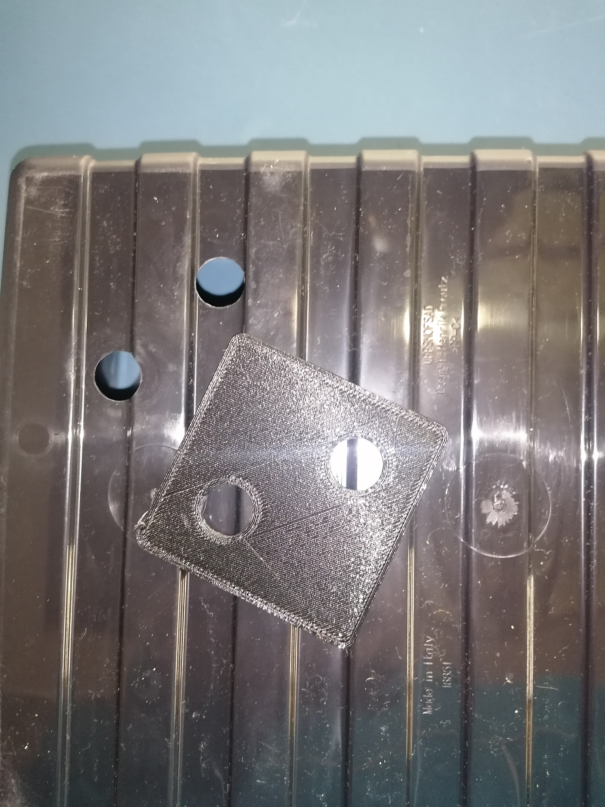
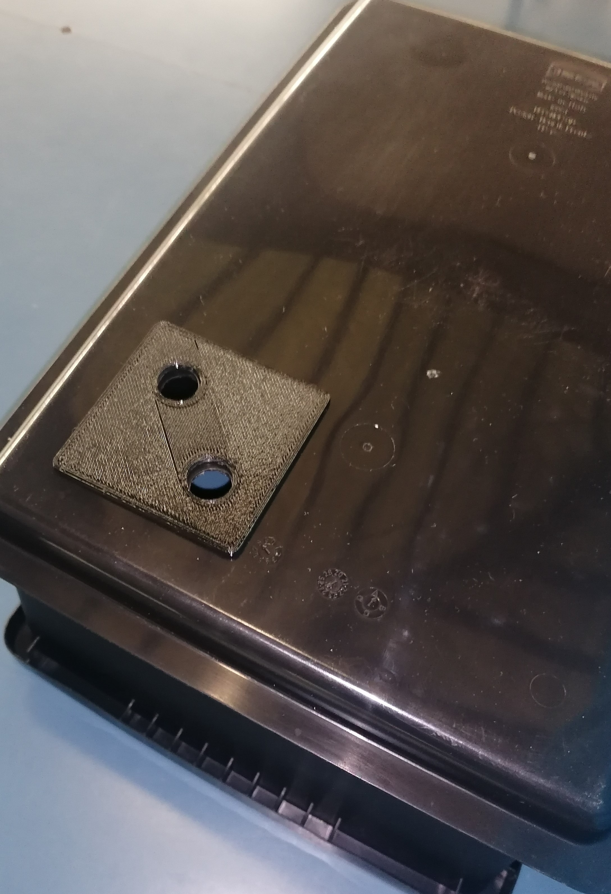
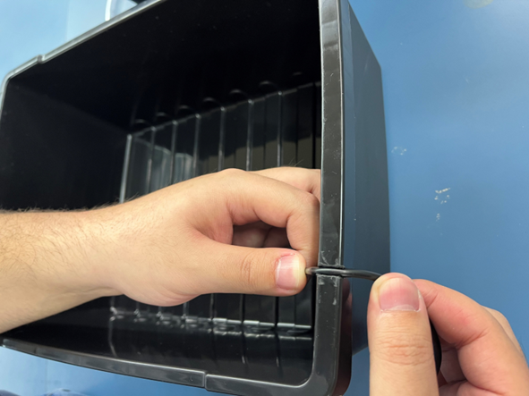
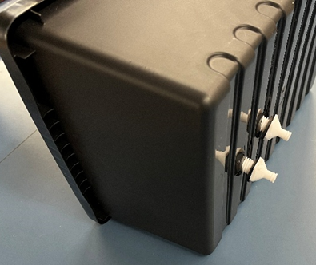

1. Preparing the containers / boxes
   
	1.1 With the help of the provided 3D template, drill two holes into one of the containers. The holes should be in one of the corners of the container. *Be careful before drilling, and make sure that the siphon (the 3D-printed plastic box) fits onto the holes* 

	1.2 Drill two holes as well into the lid of the container. *Make sure that the holes align!* 
   
	1.3 Cut a groove into the bottom container. *Make it deep enough in order for the lid to close without any problem. Furthermore, do not make it too wide because the cable must fit snugly.*

   .

3. Assembly
   
	2.1 Siphon. 
	2.1.1 Insert the two drains into the holes. *The **O-ring seals** must be on the drains.*
   

	2.1.2. Connect the siphons with the drains. *It is important to put **O-ring seals** onto these sides of the drains as well.* 
	![[Pasted image 20250411170815.png]]

	2.1.3 If the drains are correctly connected to siphon, tighten them. Screw the drains into the syphon with a wrench, or with the included 3D-designed tool. **The drains must be screwed in tightly in order to make the seals watertight.**
	
	2.2 Installing components
	2.2.1 Attch a 10-15 cm (or longer based on your container) long tube onto the drain of the siphon, which belongs to the **longer pipe**.  The siphon has two pipes, it can be found in the qubical part of the syphon. The shorter is responsible for drainage, therefore it is crucial to get this step right. ![[Pasted image 20250411171932.png]]
   
	2.2.2 Place the USB Waterpump into the bottom container below the syphon. ![[Pasted image 20250411172053.png]]
   
	2.2.3. Pull the cable through the grooves carved out in step 1.3.
	![[Pasted image 20250411172202.png]]

	2.3. Connecting parts
   
	2.3.1. Feed the plastic tube and the drains of the siphon through the holes in the lid. 
	![[Pasted image 20250411172429.png]]

	2.3.2. Attach the tube of the siphon with the water pump. *This step may require multiple attempts, as based on the length and sturdiness of the tube, the waterpump can get dislodged when the upper container is placed on the lower one.* ![[Pasted image 20250411172639.png]]
   
	2.3.3. Put the siphon cap onto the shorter pipe of the syphon. ![[IMG_20250411_093028 1.jpg]]
